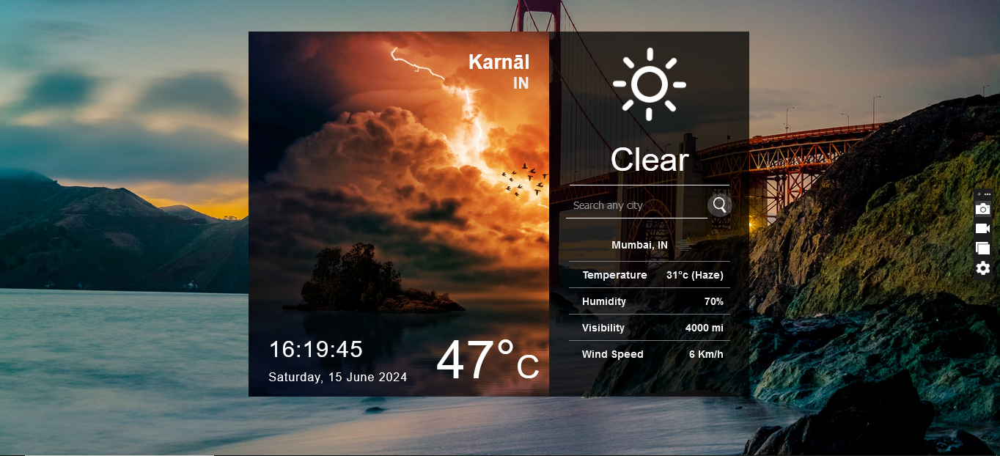

Our Weather App, built with React JS, provides users with real-time weather updates. It's a sleek, user-friendly application that allows you to check the current weather conditions for your location or search for weather information in any city worldwide.

### Refer to the image below:

      

 

### Set Up Instructions

Click to view

- Download dependencies by running `npm install`
- Start up the app using `npm start`

### Assignment Completion Instructions

Functionality

 

The app must have the following functionalities:

- Search Any City
- Fetch User's Current Location if user allow to the current Location.

### Assignment Completion Checklist

Click to view

- I have completed all the functionalities asked in the assignment
- I have used only the resources (Frameworks, Design files, APIs) mentioned in the assignment
- I have modified the README.md file based on my assignment instructions
- I have completed the assignment ON Time

### Quick Tips

Click to view

 

- axios
- react-animated-weather
- react-geolocated
- react-live-clock
- react-skycons
- skycons

### Important Note

Click to view

 

- api key - 39c535e31c02add71171254880a0bf37

### Resources

Data Fetch URLs

 

- https://api.openweathermap.org/data/2.5/

Colors

#fffff
 

Font-families

- Roboto
- sans-serif

